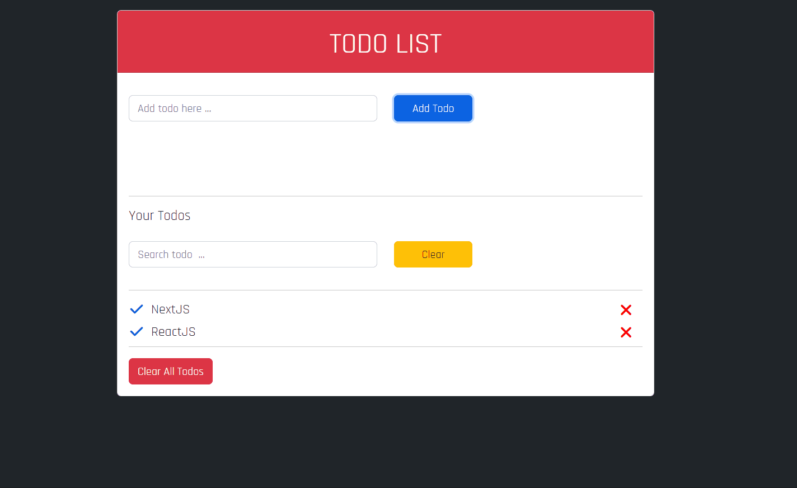

# Todo App

## Objective

- In order to improve my knowledge of jQuery, which I have been trying to learn recently, I tried to do the Todo App project, which I had done with Vanilla Javascript, this time with jQuery.

## What am i use in this project ?

- Capturing method in JS DOM,
- Locale storage for saving todo id's, text's and isDone tag
- Keydown event and its code property,
- createElement and appendChild methods to add new element inside of our HTML Document,
- fadeOut & fadeIn for alert display,
- Alert to send user some messages if something wents wrong,
- parentElement, firstElementChild, previous-nextElementSibling etc. to navigate between nodes,
- Confirm property to interact with the user,
- ClassList property and its methods to add and remove some classes of elements.

## Project Link

You can reach my To-Do app from [here](https://jquery-todo-app.vercel.app/)

### At the end of the project, following topics are to be covered;

- HTML
- CSS
- JS
- jQuery
- Bootstrap5
- Font-Awesome

### Project Skeleton

```
jquery-todo-app (folder)
|── README.md
SOLUTION
├── css
│    └── style.css
├── js
│    └── app.js 
└── index.html
```

### Installation

```
$ git clone https://github.com/esadakman/jquery-todo-app
$ cd jquery-todo-app
```
- Open the project with VS Code or other IDE's

### Preview of the Project


